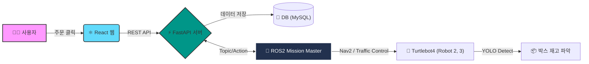

# 🐢 Turtlebot4 Multi-Robot Autonomous Logistics & Control System

> **"웹에서 클릭 한 번으로, 다중 로봇이 스스로 협업하여 물류를 처리합니다."**
> 
> 본 프로젝트는 **2대의 Turtlebot4 로봇**이 협업하여 창고 내 재고를 파악하고 이송하는 **자율주행 시스템**과, 이를 실시간으로 제어하고 모니터링하는 **O2O 통합 관제 웹 플랫폼**을 결합한 솔루션입니다.


<br>

## 🏛️ 시스템 아키텍처 (System Architecture)

사용자의 웹 주문이 실제 로봇의 자율주행 미션으로 이어지는 전체 흐름도입니다.


---

## 🤖 핵심 기능 1: 멀티 로봇 자율 협업 (Robot Intelligence)

본 프로젝트의 핵심 파트로, 좁은 창고 환경에서 다수의 로봇이 충돌 없이 임무를 완수하기 위한 고도화된 로직이 적용되었습니다.

1. 단계별 미션 수행 (Phase System)
로봇의 행동을 5단계로 세분화하여 체계적으로 관리합니다.

| 단계 | Phase Name | 설명 |
|----|-----------|------|
| 1 | Entry | 대기 장소에서 창고 진입로(`goal_1`)로 이동 (Nav2) |
| 2 | Approach | 박스 적재 위치 바로 앞으로 정밀 접근 (Nudge Control) |
| 3 | Detection | 정지 후 YOLOv8로 박스 개수 카운트 및 ROI 점유 신호 발신 |
| 4 | Delivery | 배달 위치로 이동 후 서버(DB)에 재고 데이터 전송 및 알림음 재생 |
| 5 | Return | 작업 완료 후 도킹 스테이션 복귀 및 자동 충전 (Auto Docking) |

2. 스마트 교통 정리 (Smart Traffic Control)
로봇 간 충돌 방지를 위해 이중 확인(Dual Check) 로직을 구현했습니다.

Phase Sharing: /current_phase 토픽을 통해 서로의 작업 단계를 실시간 공유합니다.

ROI Occupancy: 작업 구역(ROI) 진입 시 /ROI_robot_detected (Bool) 신호를 송출합니다.

Smart Wait: 후행 로봇은 선행 로봇이 위험 구간(Phase 1~3)에 있을 경우, 지정된 대기 장소로 회피하여 10초간 대기합니다.

3. Lidar 기반 안전 가드 (Safety Monitor)
Nav2의 Costmap과는 별개로, Raw Lidar 데이터를 직접 구독하여 비상 상황에 대처합니다.

Emergency Stop: 전방 30도, 0.4m 이내 장애물 감지 시 즉시 정지.

Active Avoidance: 정지 후 전방 100도 범위를 스캔하여 더 넓은 공간으로 회피 기동 수행.

## 🖥️ 핵심 기능 2: 통합 관제 웹 플랫폼 (Web Control)
로봇이 수집한 정보를 시각화하고 제어하는 사용자 인터페이스입니다.

실시간 대시보드: 다중 로봇의 위치(Odom), 배터리 상태, 현재 작업 Phase를 0.5초 단위로 모니터링.

원스톱 주문 시스템: 사용자가 물품을 주문하면 가용 로봇을 자동으로 배차하고 자율주행 명령 전송.

재고 데이터 동기화: 로봇이 Phase 3에서 파악한 박스 개수가 Phase 4 완료 시점에 DB에 자동 업데이트됨.

---

## 🔥 기술적 도전 및 해결 (Troubleshooting)
### 🚀 Robot Side Issues
1. Ghost Arrival 현상: goToPose 명령 직후 이동하지 않았는데 '도착 성공' 처리되는 문제.

👉 해결: 명령 전송 후 time.sleep(1.5) 강제 부여 및 distance_remaining 이중 체크 로직 추가.

2. Initial Pose 오차: 하드코딩된 초기 좌표와 실제 맵의 미세한 불일치로 인한 주행 오류.

👉 해결: setInitialPose 강제 설정을 제거하고, **"도킹 스테이션 = (0,0) = North"**라는 물리적 기준을 활용하여 Undock 후 주행 시작.

3. 벽 앞 진동(Oscillation): 좁은 회피 각도로 인해 장애물 앞에서 로봇이 떨기만 하는 현상.

👉 해결: 회피 판단 시야각을 30도에서 100도로 확장하여 탈출 경로 확보.

### ⚡ Web Side Issues
1. FastAPI & ROS2 충돌: 단일 스레드에서 웹 서버와 ROS 통신 동시 실행 시 블로킹 발생.

👉 해결: Startup Event에서 ROS2 노드를 **데몬 스레드(Daemon Thread)**로 분리하여 비동기 처리.

---

## 🛠️ 기술 스택 (Tech Stack)
| 구분 | 기술 스택 |
|----|-----------|
| Robotics | ROS 2 Humble, Nav2, Gazebo, Turtlebot4 |
| AI / Vision | YOLOv8 (Custom Trained), OpenCV, OAK-D Lite |
| Backend | Python 3.10, FastAPI, MySQL, SQLAlchemy |
| Frontend | React, JavaScript, HTML5 / CSS3 |
| Infra | Ubuntu 22.04 LTS |

---

## 📦 설치 및 실행 (How to Run)
1. 로봇 제어 노드 (Robot Side)
```bash
# 의존성 패키지 설치
sudo apt install ros-humble-turtlebot4-navigation ros-humble-nav2-simple-commander
pip install ultralytics opencv-python

# 패키지 빌드 및 실행
cd ~/rokey_ws
colcon build --symlink-install --packages-selec Picker_project
source install/setup.bash
ros2 run Picker_project picker_main
```
2. 웹 서버 및 클라이언트 (Web Side)
```bash
# Backend 실행
cd backend
pip install -r requirements.txt
python main.py

# Frontend 실행
cd frontend
npm install
npm start
```

---

## License
